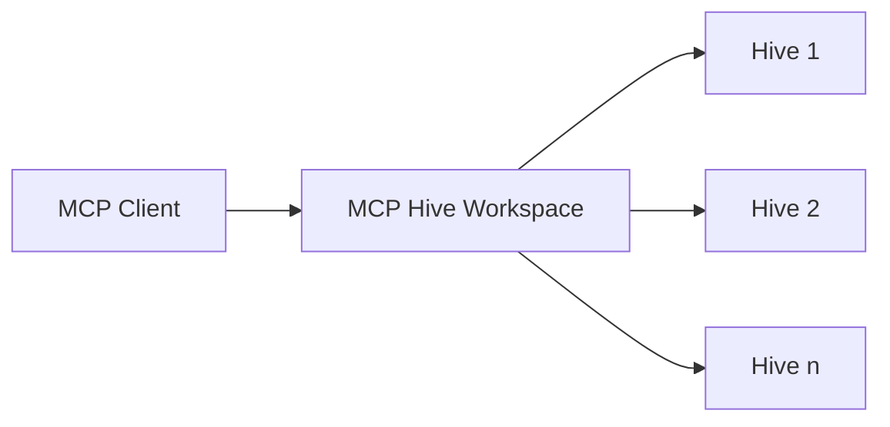

## What is MCP Hive?

MCP Hive is a marketplace for MCP (Model Capability Protocol) servers. It enables you to discover, create, and manage LLM capabilities through a unified platform.

## Key Concepts

### Hives

A hive is a collection of LLM capabilities, including:
- Tools
- Resources
- Prompts
- Other MCP-compatible capabilities

Think of a hive as a packaged set of capabilities that can be easily deployed and used with any MCP-compatible client.

### Workspaces

Workspaces are management environments where you can:
- Add and organize multiple hives
- Configure hive settings
- Manage authentication
- Access connection URLs for MCP servers

### MCP Server Connection

Every workspace in MCP Hive can function as an MCP server. This means:
- Each workspace has a unique connection URL
- Clients can connect to your workspace using the MCP protocol
- All configured hives in your workspace become available through the MCP server

## Architecture Overview

This architecture enables:
- Centralized capability management
- Easy integration with MCP clients
- Flexible configuration and scaling