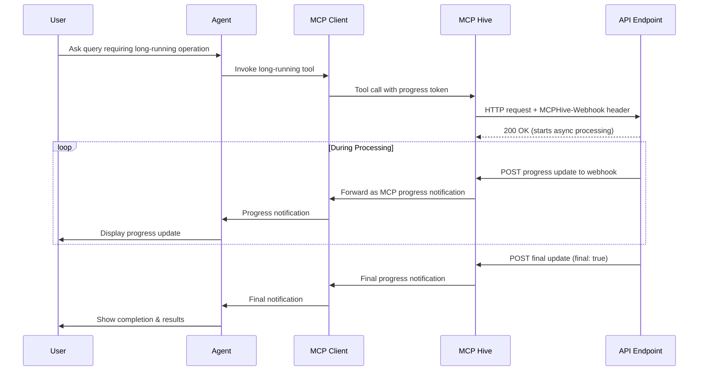

## Introduction

MCP tool calls typically timeout after 10 seconds, making long-running operations challenging. MCP Hive's Progress Updates feature enables OpenAPI-based tools to send real-time progress updates to MCP clients through a webhook system, extending operation timeouts indefinitely.

## How It Works

MCP Hive provides a webhook-based progress update system that bridges OpenAPI endpoints with MCP clients:



**Key Benefits:**
- **Seamless Integration**: No changes needed to MCP clients
- **Rich Progress Updates**: Send structured data, artifacts, and real-time status
- **Extended Capabilities**: Support for chunked artifacts and multiple content types
- **Simple Implementation**: Just enable async mode and handle webhook calls

## Getting Started

### Step 1: Enable Async Mode

In Hive Studio, enable async mode for tools that need progress updates:

1. Navigate to your hive studio page
2. Select the tool you want to enable for long-running operations
3. Click on `Async Settings` button
4. Toggle `Enable Async Mode`
5. Configure timeout settings
6. Save the configuration


### Step 2: Access the Webhook URL

When async mode is enabled, MCP Hive automatically injects the `MCPHive-Webhook` header in requests to your API endpoint:

```http
POST /your-endpoint
Content-Type: application/json
MCPHive-Webhook: https://api.mcp-hive.com/webhook/progress/task_abc123

{
  "your": "request_data"
}
```

### Step 3: Send Progress Updates

Post progress events to the webhook URL as your operation progresses.

## Event Types

MCP Hive supports two primary event types for progress updates:

### 1. TaskStatusUpdateEvent

**Purpose**: Send current processing status and progress information to keep users informed about ongoing operations.

**When to use**:
- To provide regular progress updates during long-running operations
- To send status messages explaining what's currently happening
- To indicate completion, failure, or cancellation of tasks
- **Required**: Must send a final status event to mark task completion

**Important**: A task is considered completed only when the final status event has `state` set to one of: `completed`, `cancelled`, `failed`, or `rejected`.

Use this for general progress updates during task execution:

```json
{
  "kind": "status-update",
  "final": false,
  "metadata": {
    "progress": 60,
    "total": 100,
  }, // This metadata is used to send progress notifications to the MCP client
  "status": {
    "message": {
      "parts": [
        {
          "kind": "text",
          "text": "Processing batch 6 of 10. ETA: 5 minutes"
        }
      ]
    }, // This message is shown to the user along with the current progress
    "state": "working", // one of "submitted", "working", "completed", "cancelled", "failed", "rejected"
    "timestamp": "2025-01-14T10:42:37Z"
  }
}
```

### 2. TaskArtifactUpdateEvent

**Purpose**: Send actual results, data, or files generated by your long-running operation.

**When to use**:
- To deliver the final results of your operation
- To stream large results in smaller chunks for better performance
- To send multiple types of content (text, structured data, files)

**Chunking Strategy**:
- **Single Result**: Set `append: false` and `lastChunk: true` 
- **Multiple Chunks**: 
  - First chunk: `append: false`, `lastChunk: false`
  - Middle chunks: `append: true`, `lastChunk: false` 
  - Final chunk: `append: true`, `lastChunk: true`

Use this to deliver generated artifacts and results from your long-running task:

```json
{
  "kind": "artifact-update",
  "append": false,
  "lastChunk": true,
  "metadata": {},
  "artifact": {
    "name": "Analysis Results",
    "description": "Complete analysis of dataset XYZ",
    "parts": [
      {
        "kind": "text",
        "text": "Here are the top 5 anomalies detected in the dataset: "
      },
    ]
  }
}
```

## Complete Event Flow Example

Here's how to properly combine both event types:

```python
# 1. Send initial status
updater.send_status_update("Starting data analysis...", "working")

# 2. Send progress updates during processing
updater.send_status_update("Processing 50% complete", "working", 
                          metadata={"progress": 50, "total": 100})

# 3. Send results as artifact
updater.send_artifact(
    name="Analysis Report",
    parts=[{"kind": "text", "text": "Analysis complete!"}],
    append=False,
    is_last_chunk=True
)

# 4. REQUIRED: Send final status to mark completion
updater.send_status_update("Analysis completed successfully", "completed", 
                          is_final=True)
```

## Implementation Examples

### Python Implementation

```python
import requests
import json
import datetime
import time
from typing import Dict, Any, Optional

class MCPHiveProgressUpdater:
    def __init__(self, webhook_url: str):
        self.webhook_url = webhook_url

    def send_status_update(
        self, 
        message: str, 
        state: str, 
        is_final: bool = False, 
        metadata: Optional[Dict[str, Any]] = None
    ) -> bool:
        """Send a status update to MCP Hive"""
        event = {
            "kind": "status-update",
            "final": is_final,
            "metadata": metadata or {},
            "status": {
                "message": {
                    "parts": [
                        {
                            "kind": "text",
                            "text": message
                        }
                    ]
                },
                "state": state,
                "timestamp": datetime.datetime.utcnow().isoformat() + "Z"
            }
        }

        try:
            response = requests.post(
                self.webhook_url,
                headers={"Content-Type": "application/json"},
                data=json.dumps(event),
                timeout=30
            )
            return response.status_code == 200
        except Exception as e:
            print(f"Failed to send status update: {e}")
            return False

    def send_artifact(
        self, 
        name: str, 
        parts: list, 
        description: Optional[str] = None,
        is_last_chunk: bool = True, 
        append: bool = False,
        metadata: Optional[Dict[str, Any]] = None
    ) -> bool:
        """Send an artifact update to MCP Hive"""
        artifact = {
            "name": name,
            "description": description,
            "parts": parts
        }
        
        if metadata:
            artifact["metadata"] = metadata

        event = {
            "kind": "artifact-update",
            "append": append,
            "lastChunk": is_last_chunk,
            "artifact": artifact
        }

        try:
            response = requests.post(
                self.webhook_url,
                headers={"Content-Type": "application/json"},
                data=json.dumps(event),
                timeout=30
            )
            return response.status_code == 200
        except Exception as e:
            print(f"Failed to send artifact: {e}")
            return False

# Usage Example
def process_large_dataset(data_file: str, webhook_url: str):
    """Example long-running data processing function"""
    updater = MCPHiveProgressUpdater(webhook_url)
    
    # Initial status
    updater.send_status_update("Starting data processing...", "working")
    
    try:
        # Simulate processing with progress updates
        total_records = 10000
        batch_size = 1000
        batches = total_records // batch_size
        
        for i in range(batches):
            # Your actual processing logic here
            time.sleep(2)  # Simulate work
            
            # Send progress update
            progress = (i + 1) / batches * 100
            updater.send_status_update(
                f"Processed {(i+1)*batch_size} of {total_records} records ({progress:.1f}%)",
                "working",
                metadata={
                    "progress": progress,
                    "recordsProcessed": (i+1)*batch_size,
                    "totalRecords": total_records
                }
            )
        
        # Send results as artifact
        results = {
            "summary": {
                "totalProcessed": total_records,
                "anomaliesDetected": 42,
                "processingTime": 20.5
            },
            "findings": [
                {"kind": "anomaly", "severity": "high", "count": 15},
                {"kind": "warning", "severity": "medium", "count": 27}
            ]
        }
        
        updater.send_artifact(
            name="Processing Results",
            description=f"Analysis results for {data_file}",
            parts=[
                {
                    "kind": "text",
                    "text": f"Successfully processed {total_records} records. Found 42 anomalies."
                },
                {
                    "kind": "data",
                    "data": results
                }
            ]
        )
        
        # Final status
        updater.send_status_update(
            "Data processing completed successfully",
            "completed",
            is_final=True,
            metadata={"totalProcessingTime": 20.5}
        )
        
    except Exception as e:
        # Handle errors
        updater.send_status_update(
            f"Processing failed: {str(e)}",
            "failed",
            is_final=True,
            metadata={"error": str(e)}
        )
```

### Node.js Implementation

```javascript
const axios = require('axios');

class MCPHiveProgressUpdater {
    constructor(webhookUrl) {
        this.webhookUrl = webhookUrl;
    }

    async sendStatusUpdate(message, state, isFinal = false, metadata = {}) {
        const event = {
            kind: 'status-update',
            final: isFinal,
            metadata,
            status: {
                message: {
                    parts: [
                        {
                            kind: 'text',
                            text: message
                        }
                    ]
                },
                state,
                timestamp: new Date().toISOString()
            }
        };

        try {
            const response = await axios.post(this.webhookUrl, event, {
                headers: { 'Content-Type': 'application/json' },
                timeout: 30000
            });
            return response.status === 200;
        } catch (error) {
            console.error('Failed to send status update:', error.message);
            return false;
        }
    }

    async sendArtifact(name, parts, description = null, isLastChunk = true, append = false) {
        const event = {
            kind: 'artifact-update',
            append,
            lastChunk: isLastChunk,
            artifact: {
                name,
                description,
                parts
            }
        };

        try {
            const response = await axios.post(this.webhookUrl, event, {
                headers: { 'Content-Type': 'application/json' },
                timeout: 30000
            });
            return response.status === 200;
        } catch (error) {
            console.error('Failed to send artifact:', error.message);
            return false;
        }
    }
}

// Usage Example
async function processLargeFile(fileName, webhookUrl) {
    const updater = new MCPHiveProgressUpdater(webhookUrl);
    
    await updater.sendStatusUpdate('Starting file processing...', 'working');
    
    try {
        const totalChunks = 20;
        
        for (let i = 0; i < totalChunks; i++) {
            // Simulate processing
            await new Promise(resolve => setTimeout(resolve, 1000));
            
            const progress = ((i + 1) / totalChunks) * 100;
            await updater.sendStatusUpdate(
                `Processing chunk ${i + 1} of ${totalChunks} (${progress.toFixed(1)}%)`,
                'working',
                false,
                { progress, currentChunk: i + 1, totalChunks }
            );
        }
        
        // Send results
        await updater.sendArtifact(
            'Processing Results',
            [
                {
                    kind: 'text',
                    text: `Successfully processed ${fileName}. Generated summary report.`
                },
                {
                    kind: 'data',
                    data: {
                        fileName,
                        processedChunks: totalChunks,
                        processingTime: 20,
                        status: 'success'
                    }
                }
            ],
            `Processing results for ${fileName}`
        );
        
        await updater.sendStatusUpdate(
            'File processing completed successfully',
            'completed',
            true,
            { processingTime: 20 }
        );
        
    } catch (error) {
        await updater.sendStatusUpdate(
            `Processing failed: ${error.message}`,
            'failed',
            true,
            { error: error.message }
        );
    }
}
```

## Advanced Features

### Artifact Streaming

For large artifacts, you can stream content in chunks:

```python
def stream_large_report(webhook_url: str, report_data: list):
    updater = MCPHiveProgressUpdater(webhook_url)
    
    # Send first chunk
    updater.send_artifact(
        name="Large Report",
        parts=[{"kind": "text", "text": "Report Header\n"}],
        append=False,
        is_last_chunk=False
    )
    
    # Stream middle chunks
    for i, chunk in enumerate(report_data):
        updater.send_artifact(
            name="Large Report",
            parts=[{"kind": "text", "text": f"Section {i+1}: {chunk}\n"}],
            append=True,
            is_last_chunk=False
        )
    
    # Send final chunk
    updater.send_artifact(
        name="Large Report",
        parts=[{"kind": "text", "text": "Report Footer"}],
        append=True,
        is_last_chunk=True
    )
```

### Rich Content Types

Send different types of content in your artifacts:

```python
# Mixed content artifact
mixed_artifact_parts = [
    {
        "kind": "text",
        "text": "Analysis Complete! Here are the results:"
    },
    {
        "kind": "data",
        "data": {
            "metrics": {"accuracy": 0.95, "precision": 0.88},
            "summary": "Model performed well on test dataset"
        }
    },
    {
        "kind": "file",
        "file": {
            "name": "detailed_report.csv",
            "mimeType": "text/csv",
            "uri": "https://your-storage.com/reports/detailed_report.csv"
        }
    }
]

updater.send_artifact(
    name="Complete Analysis",
    parts=mixed_artifact_parts,
    description="Full analysis with metrics, summary, and detailed CSV report"
)
```

## Best Practices

### Update Frequency
- Send updates every 5-10% of progress for long operations
- Avoid overwhelming users with too-frequent updates (minimum 2-3 second intervals)
- Always send a final event with `final: true`

### User Experience
- Include estimated completion times when possible
- Use consistent, clear messaging
- Provide meaningful progress indicators (percentages, steps completed)
- Send interim results for very long operations

### Error Handling
- Always send a final status update on errors with `state: "failed"`
- Include error details in metadata for debugging
- Implement retry logic for webhook failures with exponential backoff

### Performance
- Set reasonable timeouts for webhook requests (30 seconds recommended)
- Handle webhook failures gracefully
- Consider local buffering for critical updates

## Troubleshooting

### Common Issues

**Webhook URL not received**
- Ensure async mode is enabled for your tool in Hive Studio
- Check that your endpoint is correctly reading the `MCPHive-Webhook` header

**Progress updates not appearing**
- Verify webhook URL is being called with correct event structure
- Check that `Content-Type: application/json` header is set
- Ensure final event has `final: true`

**Timeout issues**
- Send at least one update every 30 seconds to prevent timeout
- Check network connectivity to webhook endpoint
- Verify webhook endpoint is responding with 200 status

### Debugging Tips
- Log all webhook requests and responses
- Test webhook URL manually with curl or Postman
- Monitor your application logs for error patterns
- Use the exact event schemas provided in this documentation

## FAQ

**Q: Can I use progress updates with existing tools?**
A: Yes, simply enable async mode for existing tools in Hive Studio and update your endpoint to handle the webhook.

**Q: What happens if my webhook request fails?**
A: Implement retry logic with exponential backoff. MCP Hive will handle timeout extensions based on successful webhook deliveries.

**Q: Can I send binary files in artifacts?**
A: Yes, use Base64 encoding in the `data` field or provide a `uri` to the file location.

**Q: How long can operations run?**
A: For the duration set in the async settings. MCP client may close the connection if no updates are received within 10 seconds interval.

**Q: Can I update the same artifact multiple times?**
A: Yes, use `append: true` to add content to existing artifacts or `append: false` to replace them. 